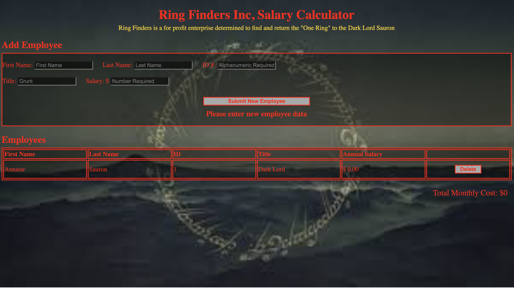

# WEEKEND-SALARY-CALCULATOR

## Description

_Duration: 3 days_

This project is a solution to the Prime Digital Academy weekend challenge of the same name. The end product meets all specs for baseline and stretch goals. The code challenge instructions are found [here](./INSTRUCTIONS.md).

To achieve the stretch goal of adjusting the monthly total after removing an employee, I implemented a global array of employee objects keying on the ID (guaranteed to be unique) and salary.  That way whenever an employee was added or removed, an updated salary could be quickly computed at will from the existing array of employees.

The styling of the interface is heavily influenced by a J.R.R. Tolien motif from the bad guys side.

## Screen Shot

### Prerequisites

- [Node.js](https://nodejs.org/en/)
- [express](https://expressjs.com/)
- [dotenv](https://www.npmjs.com/package/dotenv) Optional for using local .env files

## Installation
 
1. Open up your editor of choice and run an `npm install`
2. Initiate the server using `node server/server.js`
3. Optionally set create a `.env` file and set the port using the `PROD` variable (will default to 5001 if not set).
5. navigate to host ip and port in browser (e.g. `127.0.0.1:5001`)
6. Enjoy!!!

## Usage
How does someone use this application? Tell a user story here.

1. To add an employee
  - Fill out fields in Add Employee form
  -  ID is a required alphanumeric field is enforced
  - Salary is a required positive number field and is enforced
  - Click the `Submit New Employee` button and a new record will appear in the table
2. To remove an employee
  - Click the delete button in the relevant table row and the employee will be removed
3. Total Monthly cost appears beneath the Employees table
  - This value automatically adjusts whenever an employee is removed or added
  - A warning will display if the monthly cost exceeds the budget of $20,000.00

## Built With

1. Server Side
  - Node.js (including Express and dotenv modules)
  - javascript
2. Client Side
  - HTML
  - CSS
  - javascript

## Acknowledgement
Thanks to [Prime Digital Academy](www.primeacademy.io) who equipped and helped me to make this application a reality. (Thank your people)

